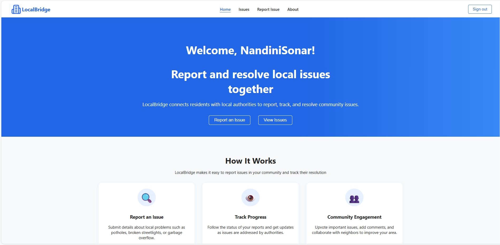
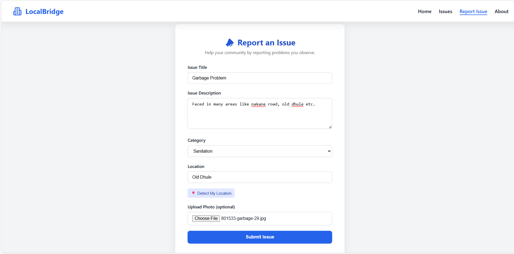
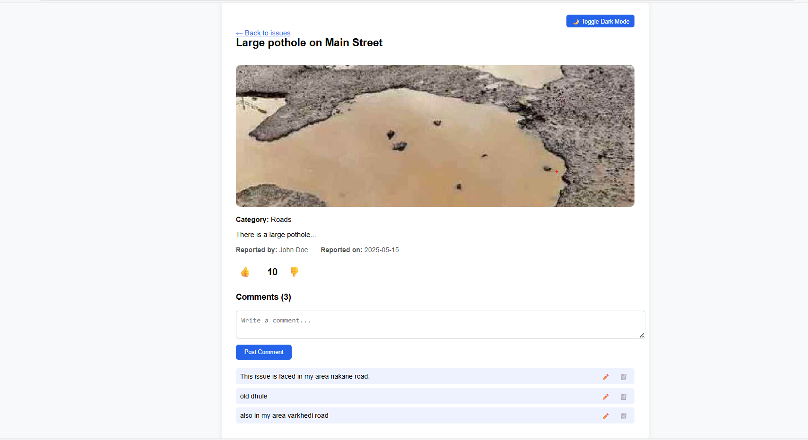
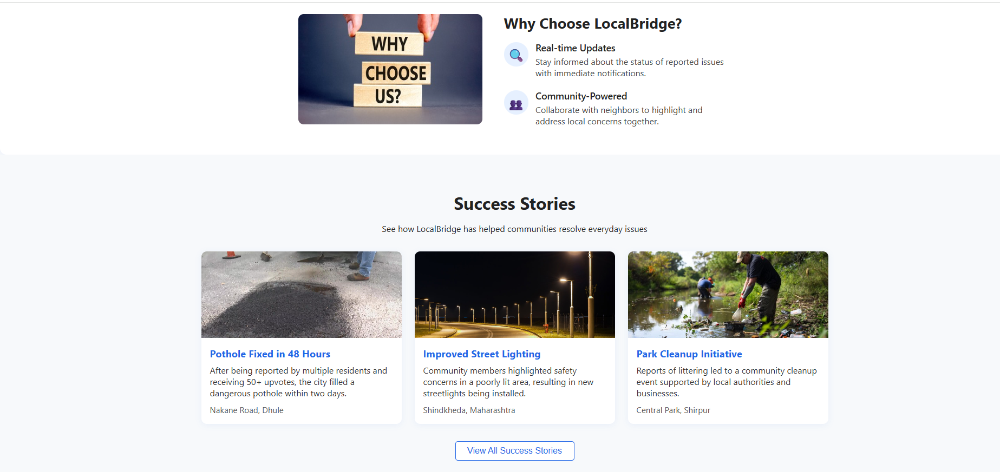
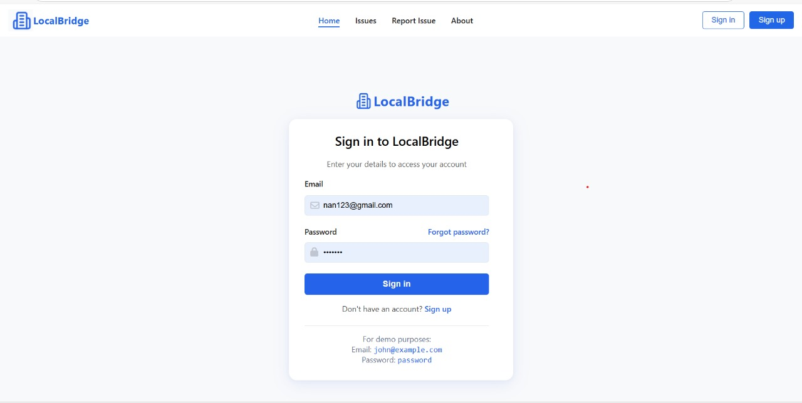
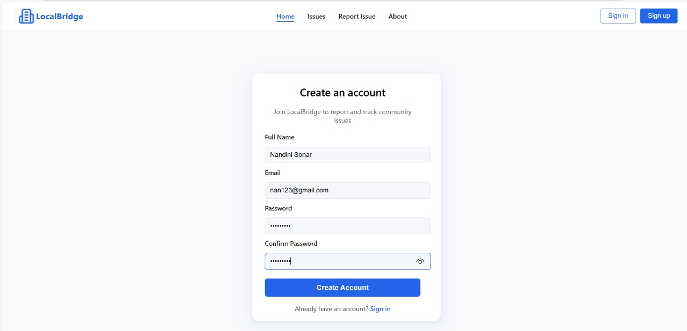
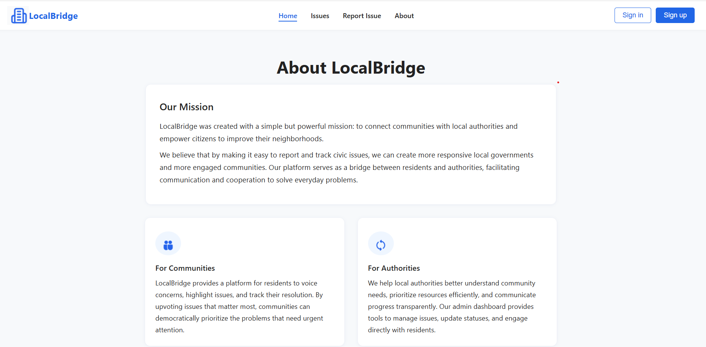

# 🌉 LocalBridge: Digital Solution for Local Problem Reporting

LocalBridge is a user-friendly, web-based civic issue reporting platform designed to connect citizens with municipal authorities. It empowers residents to report problems like potholes, garbage overflow, broken streetlights, and water leakages from any device — with real-time status tracking and community engagement.

> 🔧 Developed as a mini-project by second-year Computer Engineering students at SVKM’s Institute of Technology, Dhule (Academic Year 2024–25).

---

## 📖 Table of Contents

- [🔍 Project Overview](#-project-overview)
- [✨ Key Features](#-key-features)
- [🧱 System Architecture](#-system-architecture)
- [📸 Screenshots](#-screenshots)
- [🧰 Tech Stack](#-tech-stack)
- [🧪 Sample Workflow](#-sample-workflow)
- [🚀 Future Scope](#-future-scope)
- [🙌 Authors](#-authors)
- [📄 License](#-license)

---

## 🔍 Project Overview

The aim of **LocalBridge** is to bridge the communication gap between citizens and authorities through an intuitive and transparent platform. The system allows users to:

- Register and log in securely
- Submit local issue reports with location, description, and image
- Track status updates like “Pending,” “In Progress,” and “Resolved”
- Browse and filter community-wide issue reports
- Promote civic awareness and community responsibility

---

## ✨ Key Features

| Feature             | Description |
|---------------------|-------------|
| 📝 **Report Issues**     | File complaints about potholes, leaks, trash, and more |
| 📍 **Location Details**  | Provide exact problem location with description and image |
| 🔄 **Status Updates**    | View complaint progress: Pending → In Progress → Resolved |
| 🧩 **Category Filter**   | Filter complaints based on type: Road, Water, Garbage, etc. |
| 📸 **Image Upload**      | Upload pictures for clarity and proof |
| 🔐 **User Auth System**  | Secure sign-up and login for citizens |
| 🧑‍🤝‍🧑 **Scalable Design** | Future support for admin dashboard and mobile app |

---

## 🧱 System Architecture

### 🧑‍💻 Frontend

- `HTML`, `CSS`, `Bootstrap` — UI Layout  
- `JavaScript` — Dynamic UI interaction

### 🖥 Backend

- `PHP` — Handles form submissions, registration/login logic
- `MySQL` — Stores user and issue data

### 📊 Database Design

- **Users Table**: ID, Fullname, Email, Password, Timestamp  
- **Issues Table**: ID, Title, Description, Category, Location, Image Path, Status

📌 *Each user can report multiple issues (one-to-many relationship)*

---

## 📸 Screenshots

### 🏠 Home Page

  

### 🧾 Report an Issue

  

### 👀 See Issue Details

  

### ✅ Success Stories

  

### 🔐 Sign In

  

### 🆕 Sign Up

  

### ℹ️ About Us

  

---

## 🧰 Tech Stack

| Layer       | Technology            |
|------------|------------------------|
| Frontend   | HTML, CSS, JS, Bootstrap |
| Backend    | PHP                    |
| Database   | MySQL                  |
| Hosting    | XAMPP / LAMP stack     |
| Media      | Manual image upload system |
| Browser    | Chrome, Firefox, Edge supported |

---

## 🧪 Sample Workflow

### 👤 User Registration

1. Input name, email, and password  
2. System checks if email exists  
3. Password is encrypted  
4. User stored in DB and redirected to dashboard

### 🛠 Reporting an Issue

1. Fill in title, description, category  
2. Upload image and location  
3. Issue saved in database as "Pending"

### 🔁 Status Update (Planned for Admin)

1. Admin validates issue  
2. Updates status (e.g. In Progress → Resolved)  
3. User gets notified (future)

---

## 🚀 Future Scope

- 🔑 **Admin Dashboard** for government staff
- 📱 **Mobile App** for Android/iOS
- 🛰️ **Google Maps API** for location tagging
- 📢 **Notifications** via Email/SMS
- ⬆️ **Upvotes & Comments** to prioritize issues
- 📊 **Analytics Dashboard** for authorities

---

## 🙌 Authors

Project by **Second Year Computer Engineering** students at SVKM’s IoT, Dhule (2024–25):

- 👤 [Kanishka Dinesh Wani](https://github.com/Kanishka-Wani)  
- 👤 Harshala Ganesh Suryawanshi  
- 👤 Nandini Jitendra Sonar  
- 🧑‍🏫 Guide: Prof. Rinku Sharma

---

## 📄 License

This project is licensed under the MIT License. See [LICENSE](LICENSE) for details.

---

> “Local voices lead to local solutions. Let’s build smarter cities together.” 🌍
